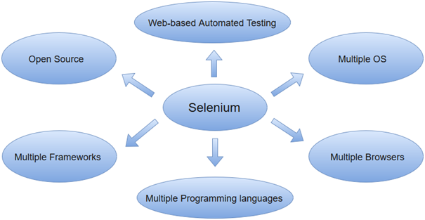
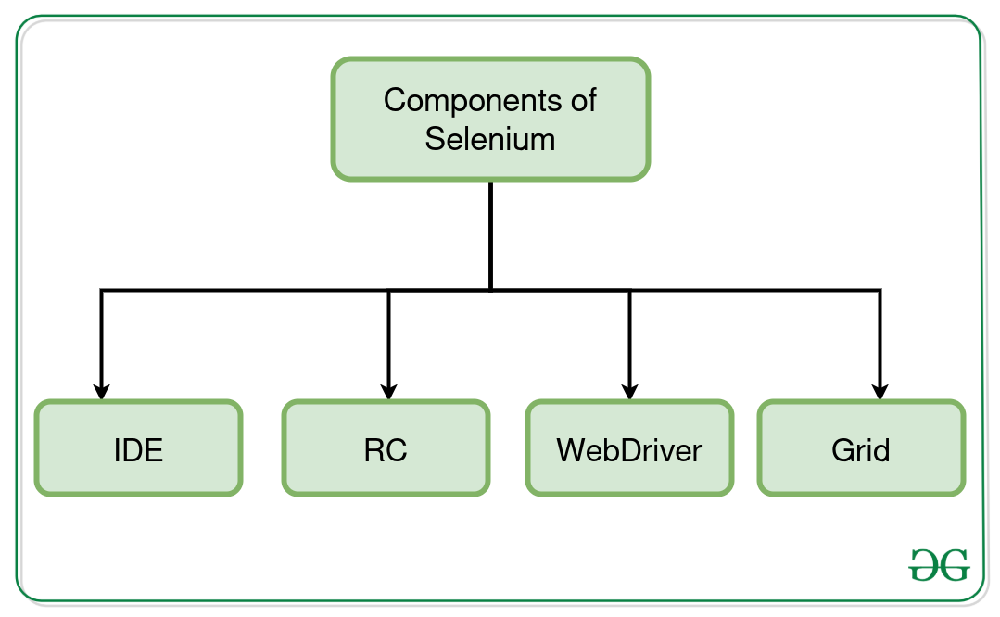

# Assignment 06 - Presentation - Selenium
## Venkata Sai Prakash Boddu

### Introduction to Selenium
 * Selenium is an open-source framework and set of libraries that enables automated web testing. 
* It has gained immense popularity in the software testing community due to its flexibility, robustness, and extensive features.

  

* Selenium consists of several components, but the two most widely used are Selenium WebDriver and Selenium IDE.

  

### Selenium WebDriver:
* It is the core component that allows you to interact with web browsers programmatically. It supports various browsers like    Firefox, Chrome, Edge, and more, enabling cross-browser testing.
* Selenium WebDriver is the powerhouse of Selenium, providing a powerful programming interface for automating web testing.
With WebDriver, you can perform a wide range of actions on web elements, such as finding elements, clicking buttons, entering text, and interacting with dropdowns and checkboxes.
* WebDriver interacts directly with the browser, allowing you to simulate user actions and verify expected outcomes.
* WebDriver supports various programming languages, including Java, Python, C#, Ruby, and more, making it accessible to testers with different language preferences.

### Selenium IDE (Integrated Development Environment):
* It is primarily a record/run tool that a test case developer uses to develop Selenium Test cases. 
* Selenium IDE is an easy-to-use tool from the Selenium Test Suite and can even be used by someone new to developing automated test cases for their web applications.
* Selenium IDE is particularly useful for beginners or testers who prefer a visual approach to test automation.
* It provides a user-friendly interface that allows testers to record their interactions with a web application and generate corresponding test scripts.
However, it has some limitations compared to WebDriver, such as limited support for handling dynamic web elements and lack of programming capabilities.

### Selenium Grid:
* Selenium Grid is a component of the Selenium testing framework that enables simultaneous test execution on multiple machines or browsers in a distributed environment. 
* It allows you to run tests in parallel across different operating systems, browsers, and versions, significantly reducing the overall test execution time.
* Selenium Grid follows a hub-node architecture, where a central hub acts as a server that manages the test distribution and execution on remote machines called nodes. 
* Grid supports both sequential and parallel test execution and is particularly useful for testing web applications across different configurations.

#### Selenium RC (Remote Control):
* Selenium RC, also known as Selenium 1, was the first Selenium tool that allowed executing tests on multiple browsers by controlling them from a single machine. 
* It consists of two main components: the Selenium RC server and the client libraries. 
* The Selenium RC server acts as a proxy between the test script and the browser, allowing commands and responses to be transmitted back and forth. 
* The client libraries, available in various programming languages, provide an interface for writing test scripts that interact with the Selenium RC server. Selenium RC has been deprecated and replaced by Selenium WebDriver, which offers a more robust and efficient way of automating browser interactions.

### Supported Languages and Platforms:
* Selenium offers language bindings for several popular programming languages, allowing testers to write automated tests using their preferred language.
* You can choose from languages like Java, Python, C#, Ruby, and more, depending on your team's expertise and project requirements.
Selenium is also cross-platform compatible, meaning it can be used on Windows, Mac, and Linux systems. It provides flexibility and ensures that your tests can run seamlessly on different operating systems.

### Selenium Integration with Testing Frameworks:
* Selenium seamlessly integrates with popular testing frameworks such as JUnit, TestNG, NUnit, and others.
* Testing frameworks provide a structured and organized approach to test automation. They offer features like test case management, test reporting, test parallelization, and support for test data management.
* Integrating Selenium with testing frameworks enhances test management, allows for better test organization, and promotes collaboration among team members.
* You can leverage the capabilities of both Selenium and the testing framework to create robust and scalable test suites.

### Advanced Features and Techniques:
* Selenium provides several advanced features and techniques that empower testers to create efficient and maintainable test scripts.
* Handling dynamic web elements: Selenium offers various strategies like XPath, CSS selectors, and dynamic waits to handle dynamic web elements that may change their attributes or positions.
* Test data management and parameterization: Selenium allows you to manage test data effectively and parameterize your test scripts, making them more versatile and reusable.
* Best practices for test case design and maintenance: Selenium encourages the adoption of best practices such as modularity, separation of concerns, and proper test design, ensuring scalability and maintainability of test suites.

### Selenium Grid and Parallel Testing:
* Selenium Grid is a powerful feature that allows for distributed and parallel test execution across multiple machines and browsers.
* It consists of a central hub that distributes test execution requests to individual nodes, each running on different machines and browsers.
* Parallel testing with Selenium Grid significantly reduces test execution time and increases test coverage, enabling you to test your application on different browsers and platforms simultaneously.
* Selenium Grid is particularly useful for teams working on large-scale projects or those with tight deadlines, as it boosts efficiency and accelerates the overall testing process.

### Reporting and Continuous Integration:
* Test reporting is crucial for providing clear insights into test results and facilitating analysis.
* Selenium can be integrated with popular reporting tools like ExtentReports, Allure, ReportNG, and others, which generate comprehensive and visually appealing test reports.
* Selenium also seamlessly integrates with CI/CD (Continuous Integration/Continuous Delivery) tools like Jenkins, TeamCity, Bamboo, and others. This integration enables the automation of the entire testing workflow, ensuring continuous testing and deployment.

### Conclusion

Selenium is a powerful and widely adopted tool for web testing automation.
By mastering Selenium, we can increase test coverage, improve efficiency, and deliver high-quality web applications.
